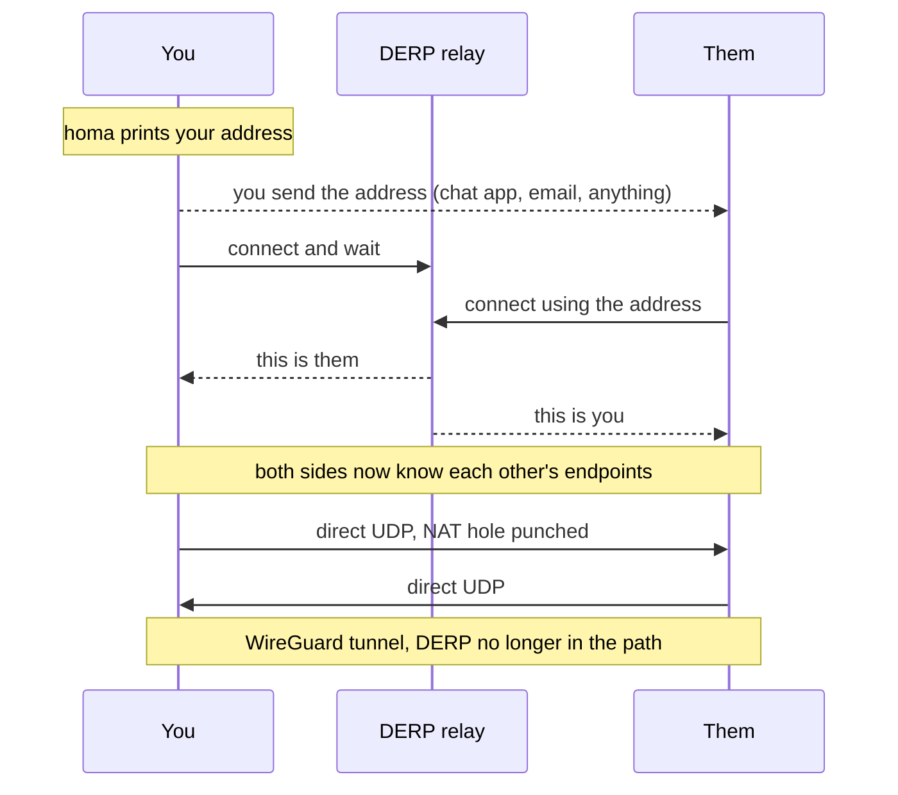
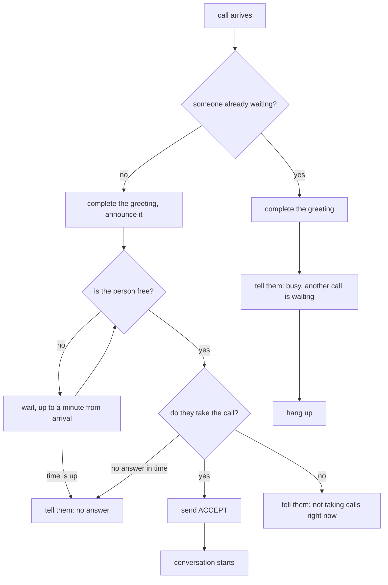
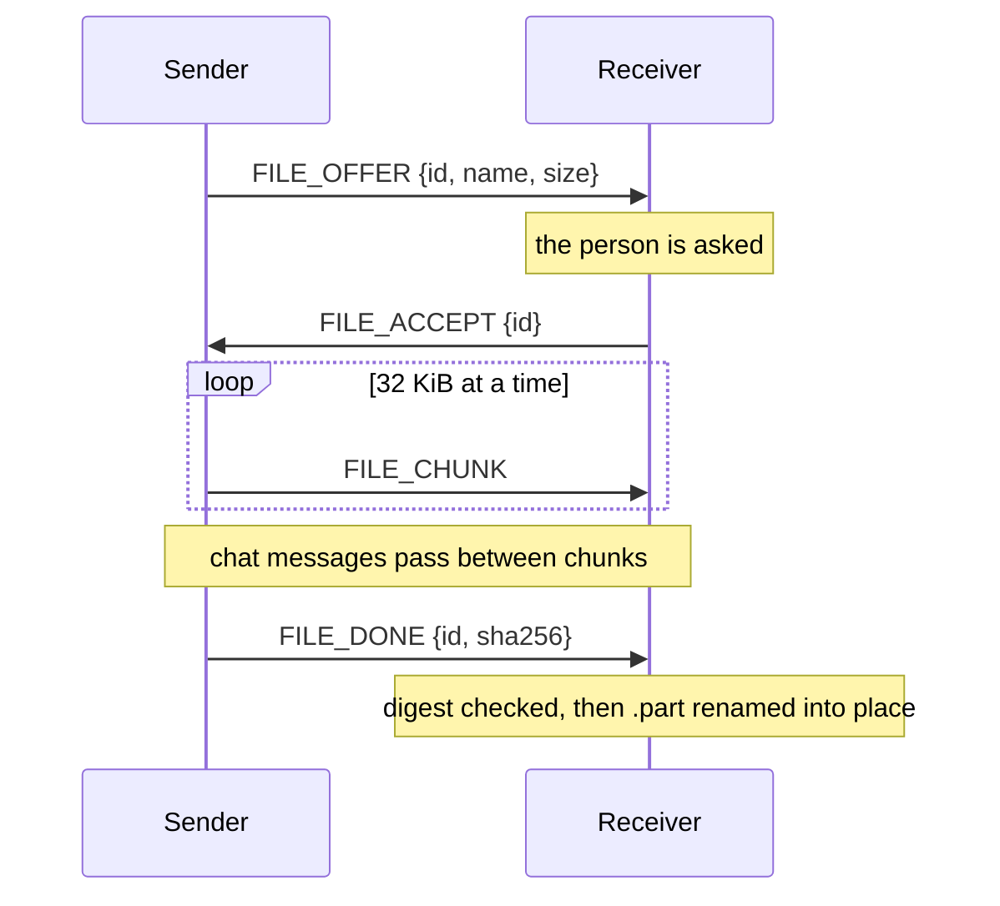
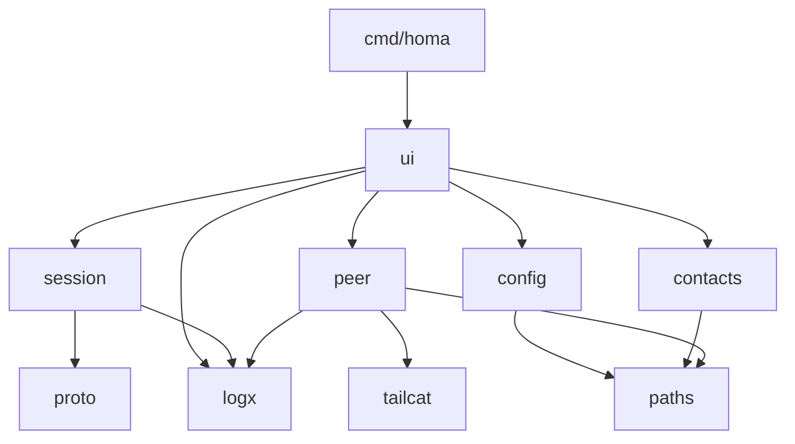
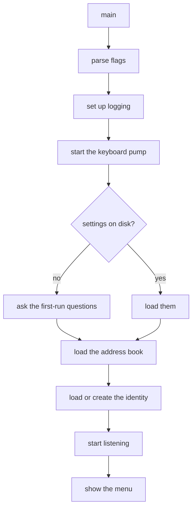
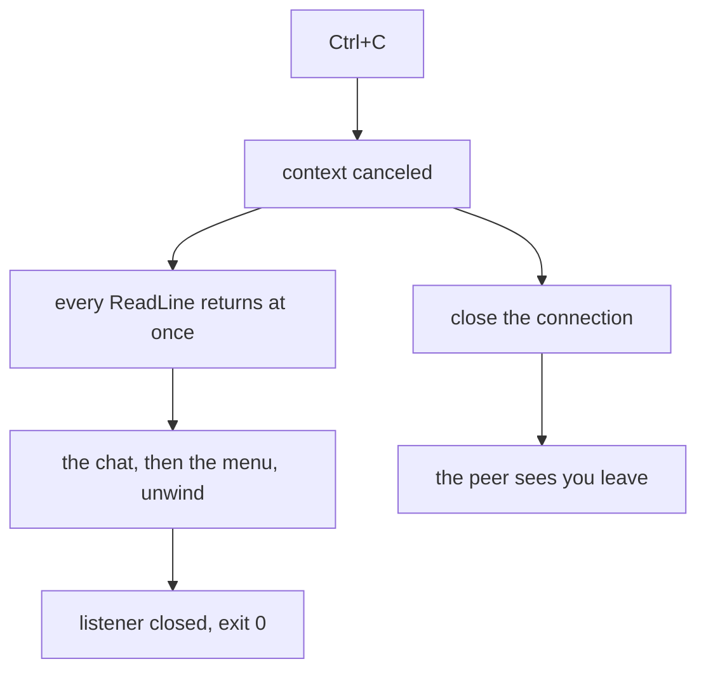

# homa

A peer-to-peer terminal chat. Two machines exchange an address once, then talk
directly: encrypted, without an account, without a server in the middle, and
without either of them being "the server".

```
$ homa

homa | mohsen
  your address starts with tcpGFwWCAD...
  listening for callers

What now?
  1) call server-b
  n) add a contact
  a) show my address
  s) settings
  q) quit
> choice: 1

  calling server-b...
  talking to server-b (they call themselves "server-b")
  /help for commands, /quit to leave

[me] salam
[server-b] salam, chetori
[me] /send ~/poster.tar.gz
  offering /Users/mohsen/poster.tar.gz, waiting for them to accept...
  sending: 100%
  sent.
```

## What it is

- **Text chat** between two machines, anywhere, through NAT and firewalls.
- **File transfer** over the same connection, so chat keeps flowing while a
  file is on its way.
- **An address book**, so nobody pastes a two hundred character address twice.

## What it is not

- Not a group chat. One conversation at a time. Rooms are planned.
- Not a message archive. Nothing you say is written to disk.
- Not a Tailscale client. It uses Tailscale's data plane, not their service.

## How it connects

homa is built on [tailcat](https://github.com/tailscale/tailcat), which is
Tailscale's encryption and NAT traversal without Tailscale's control plane. No
account, no coordination server, no shared tailnet. Two peers need nothing in
common except one string.



If a direct path cannot be established, DERP stays in the path as a relay. It
never sees your content: the tunnel is encrypted end to end, and the pre-shared
key inside your address keeps the relay operator out of it.

### The address is a secret

Your address carries the pre-shared key that guards your tunnel. Anyone holding
it can call you. Treat it like a password: send it over a channel you trust, and
do not paste it into a public issue.

homa shows the full address in exactly one place, the `a` menu entry. Everywhere
else it is shortened.

## Install

Requires Go 1.27.1 or newer.

```sh
go install github.com/Serajian/homa/cmd/homa@latest
```

Or from a clone:

```sh
git clone https://github.com/Serajian/homa.git
cd homa
make build      # ./build/homa
make install    # into $(go env GOPATH)/bin
```

Cross-compiling for a server:

```sh
make build-linux    # ./build/homa-linux-amd64
```

## Quick start

On both machines:

```sh
homa
```

The first run asks two questions, then prints your address.

1. On machine A, press `a` and copy the address.
2. Send it to machine B however you like.
3. On machine B, press `n`, give A a name, paste the address.
4. Pick A from the menu.

From then on both machines know each other by name, and either can call the
other.

## In a conversation

| Command | What it does |
| --- | --- |
| `/files [dir]` | list a directory, numbered |
| `/send <path>` | offer a file |
| `/send <n>` | offer one from the last listing |
| `/accept` | take the file being offered |
| `/reject` | refuse it |
| `/who` | who you are talking to |
| `/clear` | wipe the screen |
| `/help` | this list |
| `/quit` | leave the conversation, not homa |

Anything not starting with `/` is a message.

Typing a path exactly right, with no completion and nothing to look at, is not
a thing to ask of somebody mid-conversation. `/files` shows a directory and
`/send` takes a number out of it:

```
[me] /files ~/Downloads
  /Users/mohsen/Downloads
    1) archive/              dir
    2) gozaresh nahayi.pdf   4.2 KB
    3) poster.png            1.1 MB
[me] /send 2
```

A number is a number and anything else is a path, so a file actually named `2`
is sent as `/send ./2`. Tab completion needs the terminal in raw mode and waits
for the full-screen interface.

A file is never written without you accepting it, and an accepted file never
overwrites one already there: `poster.png` becomes `poster (2).png`.

## Command line

```
homa [flags]

  -log <path>   write diagnostics to a file
  -debug        write diagnostics to stderr, at debug level
  -version      print the version and exit
```

Diagnostics go nowhere by default. homa draws a terminal interface, and a log
line landing in the middle of a conversation would scramble it. Use `-log` while
developing:

```sh
homa -log homa.log -debug
tail -f homa.log
```

## Files on disk

Everything lives in one directory: `~/.config/homa` on Linux,
`~/Library/Application Support/homa` on macOS. It honors `XDG_CONFIG_HOME`.

| File | Holds | Mode |
| --- | --- | --- |
| `key.json` | your permanent identity and pre-shared key | `0600` |
| `config.json` | display name, download directory | `0600` |
| `contacts.json` | the names you gave people, and their addresses | `0600` |

The directory is `0700`. Everything in it is either a secret or a private list,
so nothing is world readable.

Deleting `key.json` gives you a new identity and a new address, and everyone who
saved the old one can no longer reach you. `r` at the menu does all three at
once, after making you type the word `reset`: a letter is answered by reflex and
this has no undo.

## How a call is answered

homa listens from the moment it starts, so either side can call the other. The
greeting is completed the moment a call arrives, so the caller is connected
rather than waiting on a handshake, and the menu waits on the keyboard and on
arriving calls together, so the question reaches you as the call lands.

Then it asks. Having your address is not the same as being welcome to talk to
you, so nothing is put through until you say yes. Refusing is the default, and a
refused caller is told rather than dropped.

The caller waits to be let in. A finished handshake means two programs are
talking, not that a person agreed, so the side being called sends a frame of its
own the moment you say yes, and until then the caller is told they are waiting
rather than that they are talking.

A call still waits when you are already in a conversation or answering a
question, and is put to you as soon as you are free — but not forever. A minute
after it arrived, counted from then rather than from when it reaches you, it is
hung up on and both sides are told why. Both sides watch the same clock run
down: the question you are being asked carries the time left, and so does the
line the caller is waiting on.



A caller who is turned away is told why. Guessing why a connection died is worse
than being told.

## Who is calling

A peer announces a name during the handshake, but a name is just text they
typed. What actually identifies them is the key underneath the tunnel, which the
WireGuard handshake proved. So homa decides what to call somebody by key, never
by what they say:

- **a name from your address book**, when the key matches one. The first time
  you reach a contact their key is recorded, so their next call arrives under
  the name you gave them.
- **`~` and the name they announced**, when it matches nothing. Their own name
  is more use than "someone not in your contacts" on every line, and the `~`
  is what keeps the two apart: contact names never carry it, so a caller who
  names themselves `BB` shows up as `~BB` and cannot pass for the `BB` you
  saved.

A call that arrives brings no key, only the tunnel address it came from, whose
last ten bytes are the first ten of the caller's key. That is enough to pick one
contact out of an address book, and a prefix matching two contacts names
neither. It chooses a label and nothing more: what authenticates a peer is the
tunnel, and no address book adds to or subtracts from that.

## The wire protocol

A TCP stream has no message boundaries, so homa frames its own. Every message is
a length, a type, and a payload:

```
+----------+--------+------------------+
| 4 bytes  | 1 byte |   N bytes        |
| N, big   |  type  |   payload        |
| endian   |        |                  |
+----------+--------+------------------+
```

| Type | Name | Payload | Meaning |
| --- | --- | --- | --- |
| `0x01` | HELLO | JSON | who I am, which protocol version |
| `0x02` | TEXT | UTF-8 | a chat message |
| `0x03` | FILE_OFFER | JSON | id, name, size |
| `0x04` | FILE_ACCEPT | JSON | id |
| `0x05` | FILE_REJECT | JSON | id, reason |
| `0x06` | FILE_CHUNK | 4-byte id + raw bytes | a piece of a file |
| `0x07` | FILE_DONE | JSON | id, sha256 |
| `0x08` | BYE | empty | I am leaving |
| `0x09` | ACCEPT | empty | the person took your call |

ACCEPT is version 2 of the protocol, and the only frame a caller waits for. A
peer announcing version 1 never sends it, so a caller seeing version 1 does not
wait; a version 1 peer receiving it skips it as an unknown type, which is what
the framing has always done with anything it does not recognise. A version
mismatch is never fatal.

Metadata is JSON because it is readable and extensible. File chunks are raw
bytes with a four byte id, because base64 inside JSON would add a third to every
transfer.

A frame's payload is capped at 1 MiB, so a peer cannot announce a huge length
and make homa allocate it. The largest frame homa itself produces is a 32 KiB
chunk.

### A transfer



Bytes land in a `.part` file that is renamed only after the digest matches. An
interrupted or corrupted transfer never leaves a file that looks finished. A
mismatch discards the file: TCP already catches damage in transit, so a mismatch
means the two sides disagree about the content.

## Architecture

Dependencies point one way. Nothing below knows about anything above it.



| Package | Responsibility |
| --- | --- |
| `cmd/homa` | flags, logging, signals, wiring |
| `internal/ui` | the menu, the chat screen, everything a person sees |
| `internal/session` | one conversation: handshake, read loop, files |
| `internal/proto` | framing and message types |
| `internal/peer` | listening, dialing, identity |
| `internal/config` | the settings a person chose |
| `internal/contacts` | the address book |
| `internal/paths` | where files live, and writing them safely |
| `internal/logx` | one logging switch for the whole program |

Two rules hold the shape:

**`internal/peer` is the only package that imports tailcat.** Its exported API
deals in `net.Conn` and plain strings. Swapping the transport later means
rewriting that package and nothing else.

**`internal/session` knows nothing about terminals, and `internal/ui` knows
nothing about wire formats.** A session reports to a `Handler`; the UI
implements it. That is the seam a full-screen interface will slot into without
touching anything below.

### Startup



Creating an identity measures relay latency once and freezes the choice, because
the relay's number is encoded in your address. Letting it drift would change
your address on every launch and break every contact who saved it.

### Shutting down

Cancelling a context does not wake a goroutine blocked on the keyboard: that
read is a system call the runtime cannot interrupt. So homa never waits on that
read directly. One goroutine, started at launch, does nothing but read lines and
hand them over on a channel, and everything else selects between that channel
and whatever else it is waiting for. Ctrl+C is then just another case in the
select.



The reading goroutine is left blocked on input the process is about to abandon.
That is one goroutine for the life of the program, and it is the price of a read
that cannot be interrupted.

## Security notes

**Everything from the network is sanitized before it is printed.** A terminal
obeys what it is given: an escape sequence in a nick or a message could clear
your screen, and a carriage return could repaint earlier lines to forge messages
that were never sent. Text and names are stripped of control characters, forced
to valid UTF-8, and truncated by runes rather than bytes.

**A peer chooses the file name they send.** It is passed through
`filepath.Base` and stripped before anything touches the disk, so a name like
`../../.ssh/authorized_keys` cannot escape the download directory.

**A peer that sends more than it offered is cut off**, so a one kilobyte offer
cannot fill a disk.

**Your identity file is the whole of your identity.** Anyone who copies it can
impersonate you. It is written `0600` in a `0700` directory, and it is never
logged.

## Development

```sh
make            # list every target
make at-first   # install dev tools, sync deps, wire up git hooks
make check      # what CI would run
make lint       # golangci-lint
make test-race  # tests under the race detector
make doc        # the public API of every internal package
```

Git hooks live in `.githooks` and are enabled by `make git-hooks`, which
`make at-first` does for you:

- **pre-commit** runs the fast pipeline: deps, format, lint, build.
- **pre-push** runs the slow one: line wrapping, lint, race tests.

Both can be skipped with `--no-verify`, and both exist so a broken commit does
not reach the remote.

### Why the logger variable is called `lg`

Tools that process one file at a time (`goimports`, `golines`, editor
auto-import) cannot see that a package-level variable is declared in a sibling
file. A variable named `logger` therefore looks like a package selector to them,
and they helpfully add an import for some unrelated package that happens to be
called `logger`. A name that collides with no package avoids the whole class of
problem. This one cost an afternoon; please do not rename it back.

### Where the constants live

Each package keeps its tuning constants in `const.go`. Enum values stay beside
their type, so adding a frame type touches one file rather than two.

`Port`, `Version`, `ChunkSize` and `MaxPayload` are deliberately not
configurable. They are agreements between two peers, not settings: letting two
sides disagree on any of them would break the connection with no useful error.

## Roadmap

- [ ] **Version 1** two people, text, files, contacts, a line-based interface
      worth looking at, tests under it, and installation through brew and apt.
      Most of it works; what is left is listed in `docs/todo.md`
- [ ] **Version 2** a full-screen interface, which also fixes the two warts
      version 1 lives with — a message arriving while you type is printed over
      your half-finished line, and a line typed but not sent when the peer
      leaves is dropped — and an Android build. The lower three packages are
      already free of any terminal assumption, so roughly seventy percent of the
      code carries over
- [ ] **Version 3** rooms: one host, several guests, join requests. It breaks
      the two-equal-peers model everything else rests on, which is why it is
      last rather than first

## Name

Homa is the bird of Persian myth that never lands and never comes to rest,
carrying fortune to whoever it passes over.

## License

MIT
