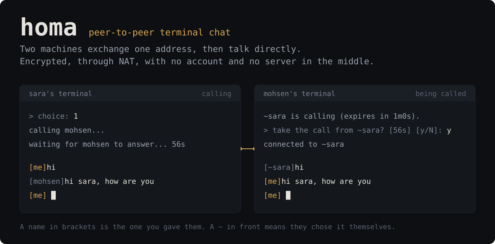

<p align="center">
  
</p>

**A peer-to-peer terminal chat.** Two machines exchange one address, then talk
directly: WireGuard between them, through NAT, on top of
[tailcat](https://github.com/tailscale/tailcat) — Tailscale's data plane with
the control plane taken out. A relay helps the two find each other and carries
traffic when no direct path can be made. There is no account, nothing in the
middle keeps your messages, and neither side is "the server": both listen and
either can call.

```sh
go install github.com/Serajian/homa/cmd/homa@latest
```

Run `homa` on both machines. The first run asks two questions and prints your
address. Give it to the other person, press `n` to save theirs, and call.

## What it is

- **A chat between exactly two people.** Rooms are version 3.
- **A file transfer**, in both directions, with a digest checked at the end.
- **A terminal program**, full-screen: a pane for what was said, an input line
  that is yours until you press Enter, and a menu with the people first.

## What it is not

- Not a group chat, not a social network, not a bot platform.
- Not anonymous. Your peer sees a network path to you, as they would on a call.
- Not a place anything is stored. Nothing is kept but your settings, your
  address book, and your key — all on your own disk.

## A real session

Screens from two homa processes on pseudo-terminals, taken by the live tests
(`make test-live`), never retyped. Bob has saved Alice; Alice has never saved
Bob, so she sees him under the name he chose, marked with a `~`.

Bob's menu, with Alice in it:

```
  >_ homa                                                  bob  ·  tcpGFwWCBzGk...  ·  ● listening
 ──────────────────────────────────────────────────────────────────────────────────────────────────

  PEOPLE                                      HOMA

  ▸  1  call alice                               n  add a contact
                                                 b  contacts: rename, forget, call
                                                 a  show my address

                                                 s  settings
                                                 c  clear the screen
                                                 h  help
                                                 u  check for updates

                                                 r  start over: forget everything
                                                 q  quit homa

  alice added.


 ──────────────────────────────────────────────────────────────────────────────────────────────────
   ↑↓  choose    Enter  call    1-1  call by number
```

Bob presses `1`. On Alice's screen, the one box the interface draws:

```
  >_ homa                                                alice  ·  tcpGFwWCAtMd...  ·  ● listening
 ──────────────────────────────────────────────────────────────────────────────────────────────────

  PEOPLE                                      HOMA

    nobody yet                                   n  add a contact
    n adds a contact, a shows your address       b  contacts: rename, forget, call
                                                 a  show my address

                                                 s  settings
                                                 c  clear the screen
                                                 h  help
                                                 u  check for updates

                                                 r  start over: forget everything
                                                 q  quit homa

  ╭─ incoming call ──────────────────────────────────────────────────────────────────────────────╮
  │  ~bob is calling                                                                        1m0s │
  │   y  take the call    n  not now                                                             │
  ╰──────────────────────────────────────────────────────────────────────────────────────────────╯


 ──────────────────────────────────────────────────────────────────────────────────────────────────
   y  take the call    n  not now
```

Alice presses `y`. Bob's side of the conversation — with a line half typed
while Alice's message arrived, untouched:

```
  >_ homa   talking to alice  ·  they call themselves "alice"          files → /tmp/bob/homa-files
 ──────────────────────────────────────────────────────────────────────────────────────────────────
       me │ salam from bob
    alice │ salam from alice
    alice │ chetori?


  ╭──────────────────────────────────────────────────────────────────────────────────────────────╮
  │ man dar                                                                                      │
  ╰──────────────────────────────────────────────────────────────────────────────────────────────╯
 ──────────────────────────────────────────────────────────────────────────────────────────────────
   PgUp PgDn  scroll    ↑ ↓  history    /help  commands    /quit  leave
```

Alice's side, where the name is the one he chose for himself:

```
  >_ homa   talking to ~bob                                          files → /tmp/alice/homa-files
 ──────────────────────────────────────────────────────────────────────────────────────────────────
          │ the name is theirs; they are not in your contacts
     ~bob │ salam from bob
       me │ salam from alice
       me │ chetori?


  ╭──────────────────────────────────────────────────────────────────────────────────────────────╮
  │                                                                                              │
  ╰──────────────────────────────────────────────────────────────────────────────────────────────╯
 ──────────────────────────────────────────────────────────────────────────────────────────────────
   PgUp PgDn  scroll    ↑ ↓  history    /help  commands    /quit  leave
```

A file, offered with `/send` on Bob's side and accepted with `y` on Alice's:

```
  >_ homa   talking to ~bob                                          files → /tmp/alice/homa-files
 ──────────────────────────────────────────────────────────────────────────────────────────────────
          │ the name is theirs; they are not in your contacts

          │ ~bob offers poster.txt (128.9 KB)    y  accept    n  reject
          │ receiving poster.txt  ██░░░░░░░░  20%
          │ receiving poster.txt  ████░░░░░░  40%
          │ receiving poster.txt  ███████░░░  70%
          │ receiving poster.txt  █████████░  90%
          │ receiving poster.txt  ██████████  100%
          │ poster.txt saved to /tmp/alice/homa-files/poster.txt


  ╭──────────────────────────────────────────────────────────────────────────────────────────────╮
  │                                                                                              │
  ╰──────────────────────────────────────────────────────────────────────────────────────────────╯
 ──────────────────────────────────────────────────────────────────────────────────────────────────
   PgUp PgDn  scroll    ↑ ↓  history    /help  commands    /quit  leave
```

Having somebody's address is not the same as being welcome to talk to them, so
nothing is put through until they say yes. Refusing is the default, and a call
nobody answers is hung up on inside a minute with both sides told why.

## In a conversation

| Command | What it does |
| --- | --- |
| `/help` | this list, or just `/` |
| `/files [dir]` | list a directory, numbered |
| `/files <n>` | list one from the last listing, `..` included |
| `/send <path>` | offer a file |
| `/send <n>` | offer one from the last listing |
| `/accept` | take the file being offered, or just `y` |
| `/reject` | refuse it, or just `n` |
| `/who` | who you are talking to |
| `/clear` | wipe the screen |
| `/quit` | leave the conversation, not homa |

You do not have to remember them. A `/` shows what can follow it in the row
above the input, and every letter narrows the row; `←` `→` walk it, Tab or
Enter take the one marked, and a word that can become nothing says so before
Enter:

```
  >_ homa   talking to alice  ·  they call themselves "alice"          files → /tmp/bob/homa-files
 ──────────────────────────────────────────────────────────────────────────────────────────────────
       me │ salam from bob
    alice │ salam from alice
    alice │ chetori?


    ▸ /help  ·  /files [dir]  ·  /send <path>  ·  /accept  ·  /reject  ·  /who  ·  /clear  ·  /quit
  ╭──────────────────────────────────────────────────────────────────────────────────────────────╮
  │ /                                                                                            │
  ╰──────────────────────────────────────────────────────────────────────────────────────────────╯
 ──────────────────────────────────────────────────────────────────────────────────────────────────
   PgUp PgDn  scroll    ↑ ↓  history    /help  commands    /quit  leave
```

Anything not starting with `/` is a message.

Typing a path exactly right, with no completion and nothing to look at, is not
a thing to ask of somebody mid-conversation. `/files` shows a directory and
`/send` takes a number out of it:

```
[me] /files ~/Downloads
  /Users/mohsen/Downloads
    1) ../                   dir
    2) archive/              dir
    3) gozaresh nahayi.pdf   4.2 KB
    4) poster.png            1.1 MB
[me] /send 3
```

Numbers work for walking as well as sending: `/files 2` goes into `archive`,
`/files 1` comes back out. A name is resolved against the directory you are
looking at rather than against wherever homa was started.

A file is never written without you accepting it, and an accepted file never
overwrites one already there: `poster.png` becomes `poster (2).png`. Progress is
reported every ten percent, so a large transfer says where it has got to and a
small one prints once.

## Who is calling

A peer announces a name during the handshake, but a name is just text they
typed. What identifies them is the key underneath the tunnel, which the
WireGuard handshake proved. So homa decides what to call somebody by key, never
by what they say:

- **a name from your address book**, when the key matches one. The first time
  you reach a contact their key is recorded, so their next call arrives under
  the name you gave them. Renaming them keeps that key.
- **`~` and the name they announced**, when it matches nothing. The `~` is what
  keeps the two apart: contact names never carry it, so a caller who names
  themselves `BB` shows up as `~BB` and cannot pass for the `BB` you saved.

## Your address is a secret

Treat it like a password. Whoever has it can call you, and it carries the
pre-shared key that guards your tunnel. Send it over a channel you already
trust.

Everything homa keeps lives in one directory — `~/.config/homa` on Linux,
`~/Library/Application Support/homa` on macOS, honoring `XDG_CONFIG_HOME` — as
`0600` files inside a `0700` directory:

| File | Holds |
| --- | --- |
| `key.json` | your identity and pre-shared key |
| `config.json` | display name, download directory |
| `contacts.json` | the names you gave people, and their addresses |

Deleting `key.json` gives you a new identity and a new address, and everyone who
saved the old one can no longer reach you. `r` at the menu does all three at
once, after making you type the word `reset`.

## Install

macOS, with Homebrew:

```sh
brew install --cask Serajian/homa/homa
```

Debian and Ubuntu, with apt — the repository is signed, and `apt upgrade`
brings later releases:

```sh
curl -fsSL https://serajian.github.io/homa/homa.gpg | sudo tee /usr/share/keyrings/homa.gpg >/dev/null
echo "deb [signed-by=/usr/share/keyrings/homa.gpg] https://serajian.github.io/homa stable main" | sudo tee /etc/apt/sources.list.d/homa.list
sudo apt update && sudo apt install homa
```

Or just the `.deb` from the
[latest release](https://github.com/Serajian/homa/releases/latest):

```sh
sudo dpkg -i homa_*_linux_amd64.deb     # or _arm64
```

Anything else: download the archive for your system from the same page and put
the `homa` binary on your `PATH`. `homa -version` says which release you have.

From source, with Go 1.27.1 or newer:

```sh
go install github.com/Serajian/homa/cmd/homa@latest
```

or from a clone, `make build` puts the binary in `./build`.

## Using it

Two people, two machines, nothing in between. Say you are Alice and want to
talk to Bob.

**1. Start it.** The first run asks two questions — the name shown beside your
messages, and where received files should go — and takes a few seconds to
measure the relays, once. Then the menu.

```
homa
```

**2. Give Bob your address.** Press `a`. The long line it prints is your
address: send it to Bob over a channel you already trust. It is a secret —
whoever has it can call you — so not in a public place.

**3. Bob adds you.** On his side: `n`, a name for you, your address. You now
appear in his menu as `1  call alice`.

**4. Bob calls, you answer.** He presses `1`. A box appears on your screen:
`~bob is calling`, with `y` to take the call and `n` not to — `y` puts him
through, `n` or Enter does not, and after a minute with no answer he is told
nobody picked up. Your terminal's bell rings, and keeps ringing every ten
seconds until you answer, as it rings once for every message and file that
arrives, so homa can sit in a window you are not looking at; `s` turns that
off. The `~` means the name is the one he chose for himself; once
you save him with `n`, he appears under the name you gave him instead.

**5. Talk.** Lines you type are sent; lines starting with `/` are commands.
What was said scrolls in the pane (PgUp/PgDn), what you are typing stays in the
box under it whatever arrives, and up and down walk what you sent. `/send
~/notes.md` offers a file, and Bob answers with `y` or `n`. `/files` lists a
directory so you can send by number instead of typing a path. Type `/` alone and
the commands appear above the input, narrowing as you type; Tab completes.
`/quit` leaves the conversation and returns to the menu.

**Later: is there a newer homa?** `u` at the menu asks GitHub for the latest
release, compares it with yours, and says the command that upgrades for the
way you installed it. It is the only time homa talks to anything but the relay,
and only because you pressed the key; nothing is downloaded.

**6. Leave.** `q` at the menu quits homa; so does Ctrl+C anywhere. Your
address, your contacts and your settings stay on your disk for next time.

Either side can call the other once each has the other's address — there is no
host and no guest. The menu keys are always on the screen; `h` explains the
ones that are not obvious, and `s` changes the two settings from the first run.

Colour is on when the terminal can show it, and never carries anything the
text does not: `NO_COLOR`, `TERM=dumb` or `homa -no-color` turn it off, and a
pipe or a log file gets plain text.

## How it is built

Dependencies point one way, and two rules hold the shape: `internal/peer` is the
only package that imports tailcat, and `internal/session` knows nothing about
terminals while `internal/ui` knows nothing about wire formats.

| | |
| --- | --- |
| [docs/overview.md](docs/overview.md) | what homa is, where it came from, the prior art it replaces |
| [docs/architecture.md](docs/architecture.md) | package layout, dependency direction, startup and shutdown |
| [docs/protocol.md](docs/protocol.md) | the frame format, every message type, a transfer end to end |
| [docs/decisions.md](docs/decisions.md) | why things are the way they are, including every security choice |
| [docs/status.md](docs/status.md) | what works today and what is still rough |
| [docs/roadmap.md](docs/roadmap.md) | versions 2 and 3 |
| [docs/conventions.md](docs/conventions.md) | code style, and the reasons behind the odd ones |
| [docs/development.md](docs/development.md) | make targets, testing across two machines |

## Development

```sh
make            # every target, with descriptions
make at-first   # dev tools, deps, git hooks
make test       # hermetic, with the race detector
make test-live  # whole processes over the real transport
make lint
make run
```

`make test` needs no network and takes seconds. `make test-live` starts real
homa processes that reach each other through a relay, and is behind the `live`
build tag so the ordinary run stays quick.

## Roadmap

- [x] **Version 1** two people, text, files, contacts, a line-based interface
      worth looking at, and installation through brew and apt. Released as
      v0.1.0
- [x] **Version 2, first item** the full-screen interface; the rest of version 2 is
      below
- [ ] **Version 2** a full-screen interface, which brings line editing, history
      and tab completion with it, plus an Android build. The lower three
      packages are already free of any terminal assumption
- [ ] **Version 3** rooms: one host, several guests, join requests. It breaks
      the two-equal-peers model everything else rests on, which is why it is
      last. Also the security work: a passphrase on the key at rest, signed
      releases, and a safer way to hand an address over

## Name

The Homa, the bird of Persian myth that never lands.

## License

MIT. See [LICENSE](LICENSE).
