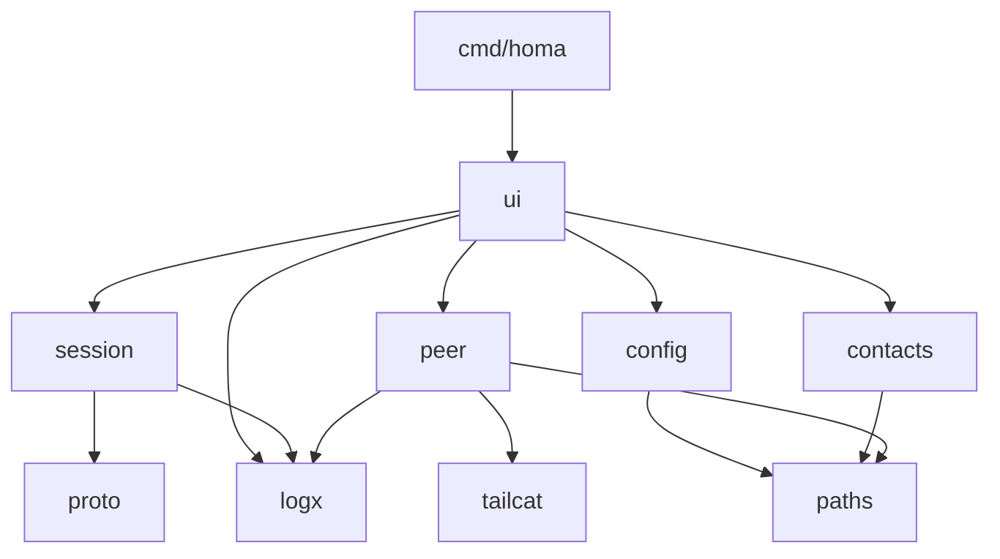
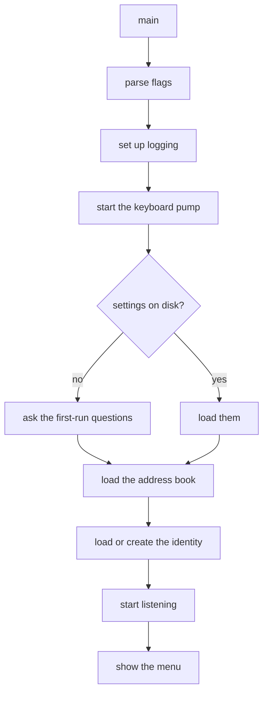
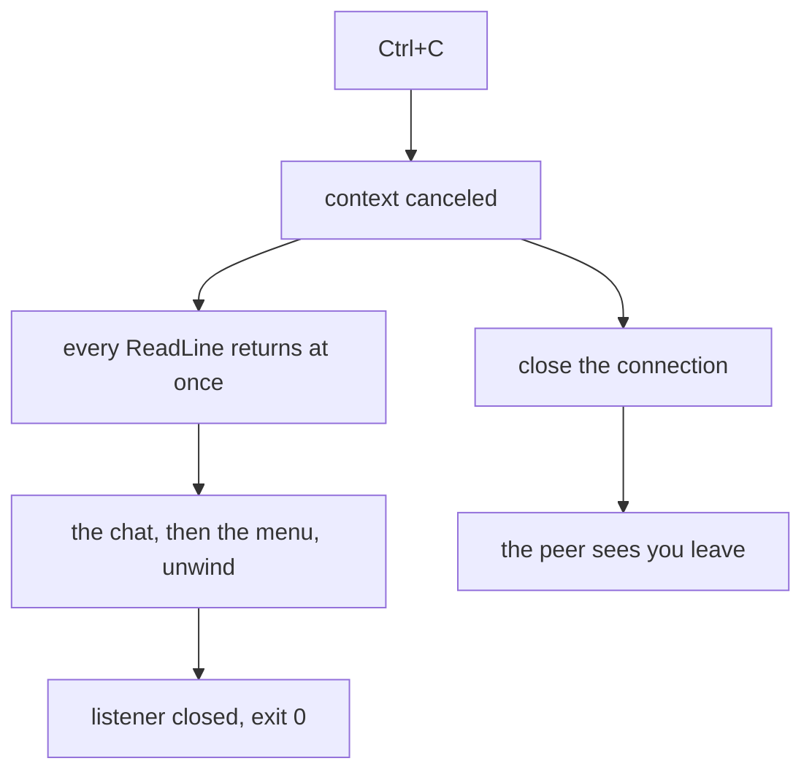

# Architecture

Dependencies point one way. Nothing below knows about anything above.

```
cmd/homa
   |
   v
internal/ui           menu, chat screen, prompts, everything a person sees
   |     \
   |      +---> internal/config     the settings a person chose
   |      +---> internal/contacts   the address book
   v
internal/session      one conversation: handshake, read loop, file transfer
   |
   v
internal/proto        framing and message types

internal/peer         listening, dialing, identity   (the only tailcat importer)
internal/paths        where files live, writing them safely
internal/logx         one logging switch for the whole program
```

## Two rules that hold the shape

**`internal/peer` is the only package that imports tailcat.** Its exported API
speaks in `net.Conn` and plain `string`. No tailcat or tailscale type appears in
any signature outside it. Swapping the transport later means rewriting that one
package. Do not leak those types outward, even "just for now".

**`internal/session` knows nothing about terminals; `internal/ui` knows nothing
about wire formats.** A session reports through a `Handler` interface that the
UI implements. This is the seam the full-screen interface will slot into, and
the seam an Android UI would reuse.

## Package responsibilities

| Package | Owns |
| --- | --- |
| `cmd/homa` | flags, logging setup, signals, wiring, exit codes |
| `internal/ui` | menu, chat, prompts, first-run setup, all output |
| `internal/session` | handshake, read loop, text, file transfer, sanitizing |
| `internal/proto` | frame layout, message structs, encode and decode |
| `internal/peer` | identity, relay choice, listen, dial, remote key |
| `internal/config` | display name, download directory, validation |
| `internal/contacts` | the address book, with its own locking |
| `internal/paths` | config directory, permissions, atomic writes, `~` |
| `internal/logx` | one switchable logger, discarding by default |

The same thing drawn:



## Startup



Creating an identity measures relay latency once and freezes the choice, because
the relay's number is encoded in your address. Letting it drift would change
your address on every launch and break every contact who saved it.

## Shutting down

Cancelling a context does not wake a goroutine blocked on the keyboard: that
read is a system call the runtime cannot interrupt. So homa never waits on that
read directly. One goroutine, started at launch, does nothing but read lines and
hand them over on a channel, and everything else selects between that channel
and whatever else it is waiting for. Ctrl+C is then just another case in the
select.



The reading goroutine is left blocked on input the process is about to abandon.
That is one goroutine for the life of the program, and it is the price of a read
that cannot be interrupted.

The reasoning behind these boundaries is in [decisions.md](decisions.md).
