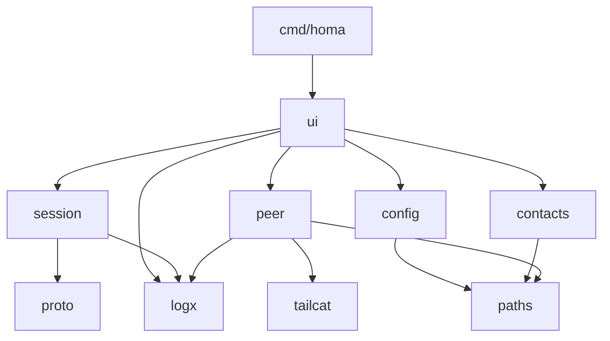
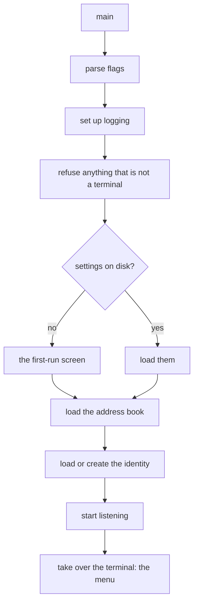
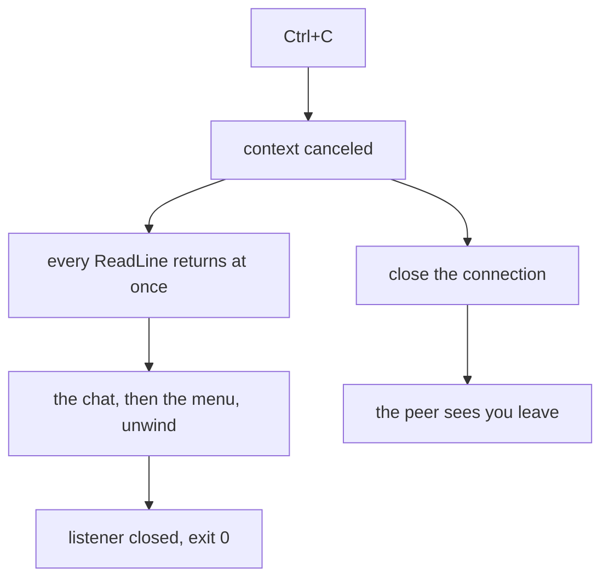

# Architecture

Dependencies point one way. Nothing below knows about anything above.

```
cmd/homa
   |
   v
internal/ui           the screens, drawn whole: everything a person sees
   |     \
   |      +---> internal/config     the settings a person chose
   |      +---> internal/contacts   the address book
   v
internal/session      one conversation: handshake, read loop, file transfer
   |
   v
internal/proto        framing and message types

internal/peer         listening, dialing, identity   (the only tailcat importer)
internal/paths        where files live, writing them safely
internal/logx         one logging switch for the whole program
```

## Two rules that hold the shape

**`internal/peer` is the only package that imports tailcat.** Its exported API
speaks in `net.Conn` and plain `string`. No tailcat or tailscale type appears in
any signature outside it. Swapping the transport later means rewriting that one
package. Do not leak those types outward, even "just for now".

**`internal/session` knows nothing about terminals; `internal/ui` knows nothing
about wire formats.** A session reports through a `Handler` interface that the
UI implements — in the full-screen interface, an adapter that turns each call
into a message for the program. This is the seam the interface was rebuilt on
without the packages below noticing, and the seam an Android UI would reuse.

## Package responsibilities

| Package | Owns |
| --- | --- |
| `cmd/homa` | flags, logging setup, signals, wiring, exit codes |
| `internal/ui` | the bubbletea program: one model, every event a message, every screen drawn whole; the first-run setup as a program of its own |
| `internal/session` | handshake, read loop, text, file transfer, sanitizing |
| `internal/proto` | frame layout, message structs, encode and decode |
| `internal/peer` | identity, relay choice, listen, dial, remote key; `Relay`, `Probe` and key fingerprints for the screens, with no transport type on them |
| `internal/update` | asks GitHub for the latest release, on request only; says the upgrade command |
| `internal/config` | display name, download directory, validation |
| `internal/contacts` | the address book, with its own locking |
| `internal/paths` | config directory, permissions, atomic writes, `~` |
| `internal/logx` | one switchable logger, discarding by default |

The same thing drawn:



## Startup



Creating an identity measures relay latency once and freezes the choice, because
the relay's number is encoded in your address. Letting it drift would change
your address on every launch and break every contact who saved it.

## Shutting down

Cancelling a context does not wake a goroutine blocked on the keyboard: that
read is a system call the runtime cannot interrupt. So homa never waits on that
read directly. One goroutine, started at launch, does nothing but read lines and
hand them over on a channel, and everything else selects between that channel
and whatever else it is waiting for. Ctrl+C is then just another case in the
select.



The reading goroutine is left blocked on input the process is about to abandon.
That is one goroutine for the life of the program, and it is the price of a read
that cannot be interrupted.

How a call crosses these packages, end to end, is drawn in
[protocol.md](protocol.md#setting-up-a-call).

The reasoning behind these boundaries is in [decisions.md](decisions.md).

## The interface

`internal/ui` is a [bubbletea](https://github.com/charmbracelet/bubbletea)
program. One `model` holds what is on the screen — which screen, the menu's
cursor, the conversation's pane and input, a call on the bar, a form — and
every `Update` runs on one goroutine, so nothing in the package is guarded by a
lock. Everything that happens elsewhere arrives as a message: a caller greeted
by the accept loop (one command that runs for the life of the program), a
line said by the far side (through the `session.Handler` adapter), a file
offered, a tick of a countdown. Commands do the blocking work — dialing,
sending a file, closing a line — and end by sending a message back.

`View` draws the whole screen every time: a two-line header, the body, a
two-line footer, cut to the terminal's size so the renderer never scrolls it.
The look is data in `styles.go`; the rules it follows are in
[decisions.md](decisions.md). The conversation's commands are one table in
`hints.go`, read by `/help`, by the "no such command" listing and by the hint
row that offers them as they are typed; the functions that narrow and
complete are pure and tested on their own. Output that is not a terminal is refused before
anything else starts, and the screen is homed before the program draws,
because it draws in place: see `clearScreen` in `const.go` for why that is not
optional.

The design and its plan are in [design/](design/).
