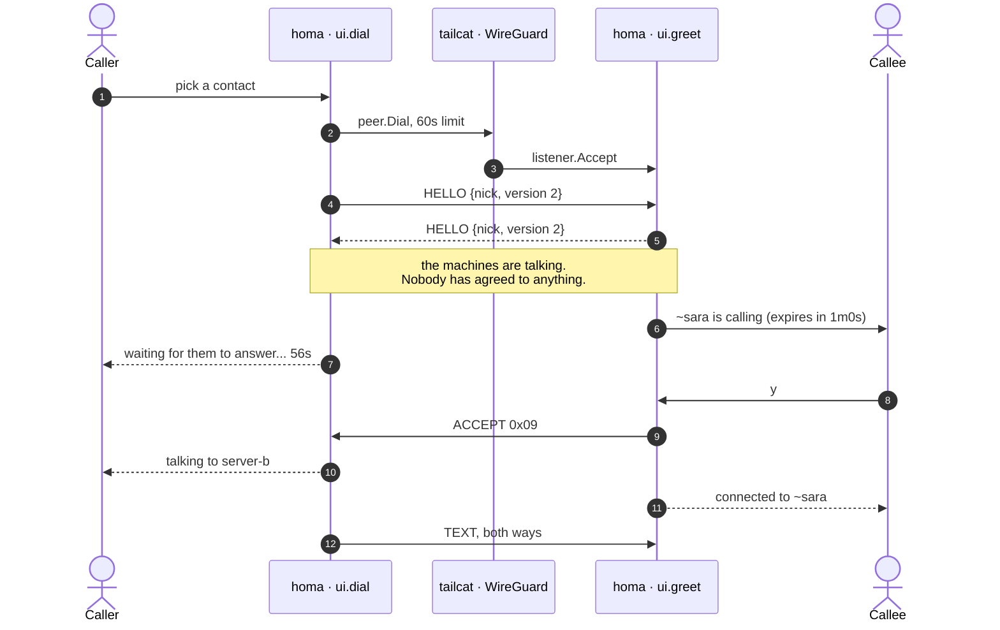
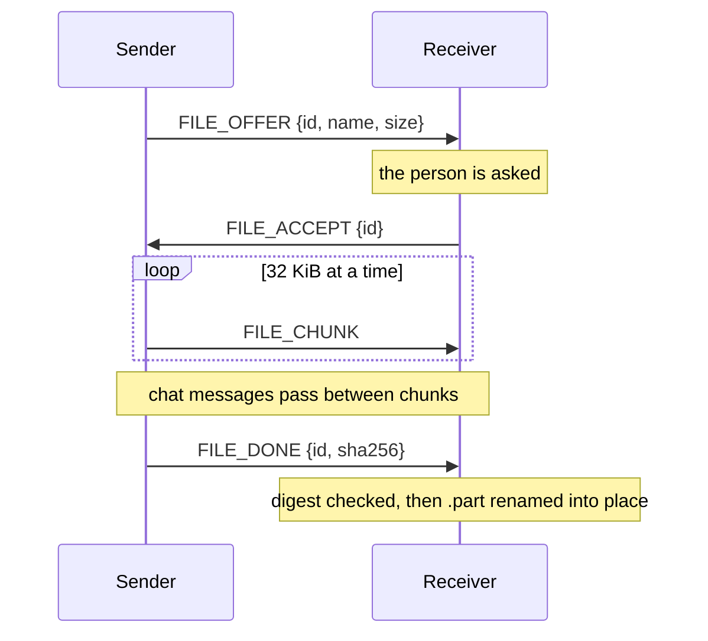

# The wire protocol

A TCP stream has no message boundaries, so homa frames its own. Every message is
a length, a type, and a payload:

```
+----------+--------+------------------+
| 4 bytes  | 1 byte |   N bytes        |
| N, big   |  type  |   payload        |
| endian   |        |                  |
+----------+--------+------------------+
```

| Type | Name | Payload | Meaning |
| --- | --- | --- | --- |
| `0x01` | HELLO | JSON | who I am, which protocol version |
| `0x02` | TEXT | UTF-8 | a chat message |
| `0x03` | FILE_OFFER | JSON | id, name, size |
| `0x04` | FILE_ACCEPT | JSON | id |
| `0x05` | FILE_REJECT | JSON | id, reason |
| `0x06` | FILE_CHUNK | 4-byte id + raw bytes | a piece of a file |
| `0x07` | FILE_DONE | JSON | id, sha256 |
| `0x08` | BYE | empty | I am leaving |
| `0x09` | ACCEPT | empty | the person took your call |

ACCEPT is version 2 of the protocol, and the only frame a caller waits for. A
peer announcing version 1 never sends it, so a caller seeing version 1 does not
wait; a version 1 peer receiving it skips it as an unknown type, which is what
the framing has always done with anything it does not recognise. A version
mismatch is never fatal.

Metadata is JSON because it is readable and extensible. File chunks are raw
bytes with a four byte id, because base64 inside JSON would add a third to every
transfer.

A frame's payload is capped at 1 MiB, so a peer cannot announce a huge length
and make homa allocate it. The largest frame homa itself produces is a 32 KiB
chunk.

## Setting up a call

The frames above in the order they are actually sent, from the menu to the first
message. The point of it is the gap between `HELLO` and `ACCEPT`: the first means
two programs are talking, the second means a person agreed.



The same thing, pannable and searchable, is in
[assets/call-setup.html](assets/call-setup.html). GitHub will not render that
file in a page; open it from a clone.

**The three other endings.** Refused, and the caller is sent the reason before
the line closes. Unanswered, and it is hung up on a minute after it arrived,
counted from arrival rather than from when the question reached the screen. Or
the caller gives up with a keypress and stays in homa.

**An older peer** never sends `ACCEPT`. The caller reads the version out of
`HELLO` and does not wait for one, and a version 1 peer skips the frame it does
not recognise. See [decisions.md](decisions.md).

## A transfer



Bytes land in a `.part` file that is renamed only after the digest matches. An
interrupted or corrupted transfer never leaves a file that looks finished. A
mismatch discards the file: TCP already catches damage in transit, so a mismatch
means the two sides disagree about the content.

The reasoning behind these choices is in [decisions.md](decisions.md).
